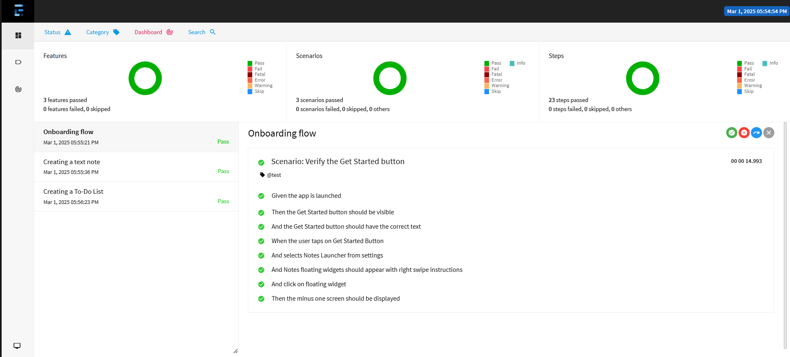
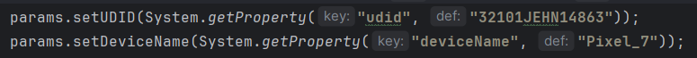

# **Notes Launcher - Mobile Automation Framework**

An Appium-based test automation framework using Java, Cucumber, Maven, and JUnit with Page Object Model (POM) design. Supports both Android and iOS in a single codebase while following industry best practices.

## Technologies/Tools used in building the framework

* IntelliJ - IDE
* Appium - Mobile Automation library
* Maven - Build automation tool
* Java - Programming language
* Cucumber - BDD
* Gherkin - DSL
* JUnit - Unit testing framework
* Log4J - Logging framework
* Extent Reports - Reporting framework
* GitHub - Version control

## Framework implements below best practices

* Supports programmatic Appium server startup for seamless test execution.
* Modular, scalable, and reusable test architecture.
* Implements Page Object Model (POM) and custom UI interaction methods (e.g., sendKeys).
* Uses explicit waits to handle dynamic UI elements.
* Parallel execution support across multiple Android & iOS devices.
* Retry mechanisms and fail-safe test design to handle intermittent failures.
* Custom logging & reporting (Extent Reports, Cucumber-HTML-Reporter, Log4J2).
* Screenshot & video recording for failed test cases.
* Dynamic scrolling mechanisms for Android and iOS (TouchAction, UiScrollable, mobile:scroll).
* Cross-platform compatibility using a unified codebase for iOS & Android.
* Parameterized test execution using TestNG XML & config.properties.

## Test Execution Report
The test execution report is automatically generated after test execution.   
The report can be found at : /target/ExtentReport/extent.html

Below is a preview of the generated report:

## Setup Instructions
### Prerequisites

Add the respective `udid` and `deviceName` of the device/emulator to be used for automation in the `GlobalParams` file, located at:

src/main/com/Notes/utils/GlobalParams.java

